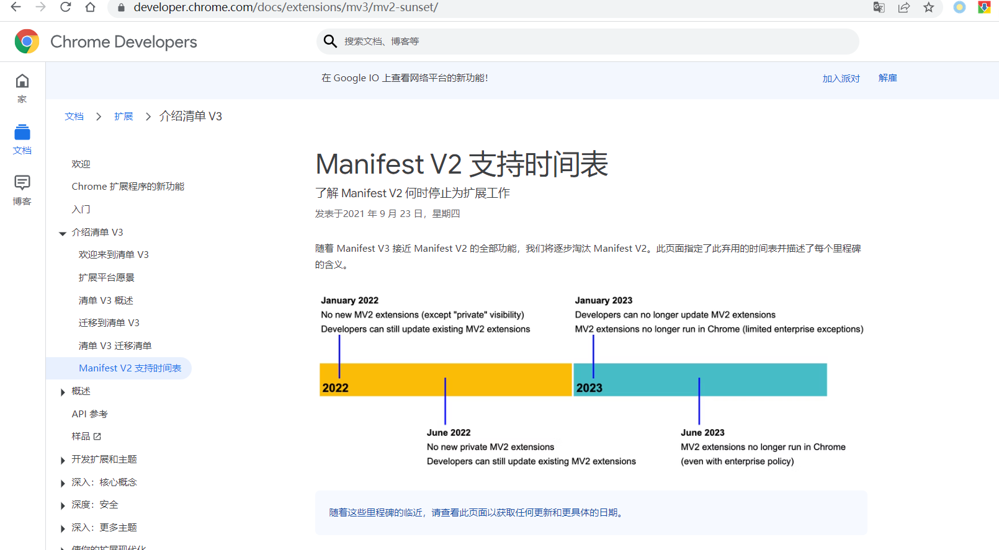

# webpack-chrome-extension

## 初始化项目

```bash
npm init
```

## 安装webpack@3.6

```bash
npm install --save-dev webpack@3.6
```

## 创建开发目录

```bash
# windows cmd下执行
md src, src\background, src\contentScripts, src\options, src\popup, src\config, src\crxConfig\assets\images

# window powerShell下执行
mkdir -p src, src/background, src/contentScripts, src/options, src/popup, src/config, src/crxConfig/assets/images

# 其他平台自行创建
```

## 创建开发基础文件

```bash
# cmd
echo console.log('This is background.js')>src\background\index.js
echo console.log('This is contentScripts.js injected here')>>src\contentScripts\index.js
echo console.log('This is options.js')>src\options\main.js
echo console.log('This is popup.js')>src\popup\main.js
type nul>src\config\config.js

# powerShell
new-item src/background/index.js -type file -force -value "console.log('This is background.js')"
new-item src/contentScripts/index.js -type file -force -value "console.log('This is contentScripts.js injected here')"
new-item src/options/main.js -type file -force -value "console.log('This is options.js')"
new-item src/popup/main.js -type file -force -value "console.log('This is popup.js')"
new-item src/config/config.js
```

## 创建开发配置config/config.js

```js
const config = {
    home: 'https://www.slong.ink',
    plugin: 'https://local.plugin.slong.ink',
    pluginApi: 'https://local.plugin.slong.ink/crx',
    prefix: '__ZSL__'
}
export default config
```

## 创建html页面模板

-   根目录下新建index.html

    ```html
    <!DOCTYPE html>
    <html lang="en">
    <head>
      <meta charset="UTF-8">
      <meta name="viewport" content="width=device-width, initial-scale=1.0">
      <meta http-equiv="X-UA-Compatible" content="ie=edge">
      <meta name="author" content="slongzhang@qq.com">
      <title>webpack-chrome-extension</title>
    </head>
    <body>
      <div id="app">
      </div>
    </body>
    </html>
    ```

## 配置webpack.config

### 创建webpack.config所需文件

-   根目录下新建webpackConfig文件夹，并创建base.js 、build.js、dev.js、devOptions.js

```bash
# cmd
mkdir webpackConfig
type nul>webpackConfig\base.js
type nul>webpackConfig\build.js
type nul>webpackConfig\dev.js
type nul>webpackConfig\devOptions.js

# powerShell
mkdir webpackConfig
new-item webpackConfig/base.js
new-item webpackConfig/build.js
new-item webpackConfig/dev.js
new-item webpackConfig/devOptions.js
```

### 配置base.js

```js
const path = require('path')
const webpack = require('webpack')
const rootPath = path.resolve(__dirname, '../'); // 定义项目根目录


const htmlWebpackPlugin = require('html-webpack-plugin') // 模板替换
const CommonsChunkPlugin = require('webpack/lib/optimize/CommonsChunkPlugin') // 提取公共模块

const CopyWebpackPlugin = require("copy-webpack-plugin") // 文件拷贝插件

// 判断打包的版本
let manifestVersion = process.env.npm_config_MV;
if (manifestVersion && trim(manifestVersion) == 2) {
  manifestVersion = 2;
} else {
  manifestVersion = 3;
}

// 处理manifest文件(因为压缩的manifest.json不便查看和修改，json文件也无法注释， 因此改用js文件来转换)
// 获取fs句柄
const fs = require('fs')
// 获取manifest内容
const manifestData = require(`../src/crxConfig/manifest.v${manifestVersion}.js`)
const manifestFile = path.resolve(rootPath, `src/crxConfig/manifest.min.json`)
// 写入数据
fs.writeFileSync(manifestFile, JSON.stringify(manifestData));


module.exports = {
  entry: {
    background: path.resolve(rootPath, 'src/background/index.js'),
    contentScripts: path.resolve(rootPath, 'src/contentScripts/index.js'),
    options: path.resolve(rootPath, 'src/options/main.js'),
    popup: path.resolve(rootPath, 'src/popup/main.js'),
  },
  output: {
    path: path.resolve(rootPath, 'dist'),
    filename: '[name]/index.js'
  },
  module: {
    rules: [{
        test: /\.css$/,
        use: [{
            loader: 'style-loader'
          },
          {
            loader: 'css-loader',
            options: {
              modules: true
            }
          }
        ]
      },
      {
        test: /\.(png|jpg|gif|svg|jpeg)$/,
        use: [{
          loader: 'url-loader',
          options: {
            limit: 8192,
            // fallback: { // 回调函数，file-loader 可以写在回调里，也可忽略，webpack会自动查找处理
            //   loader: 'file-loader',
            //   options: {
            //     publicPath: './dist/'
            //   }
            // }
          }
        }]
      },
      {
        test: /\.js$/,
        exclude: /(node_modules|bower_components)/, // 过滤目录
        use: {
          loader: 'babel-loader',
          options: {
            presets: ['es2015']
          }
        }
      },
      {
        test: /\.vue$/,
        use: ['vue-loader']
      }
    ]
  },
  resolve: {
    extensions: ['.js', '.css', '.vue'], // 省略的后缀
    alias: {
      "@src": rootPath + '/src',
      "@options": path.resolve(rootPath, '/src/options'),
      "@popup": path.resolve(rootPath, '/src/popup'),
      "vue$": "vue/dist/vue.esm.js"
    }
  },
  plugins: [
    // 提取公共部分
    new CommonsChunkPlugin({
      // 从 指定的现成的 Chunk 中提取公共的部分
      chunks: ['options', 'popup'], // 从options和popup文件抽取
      // 把公共的部分放到 base 中
      name: 'common'
    }),
    // 导出options
    new htmlWebpackPlugin({
      template: 'index.html',
      filename: 'options/index.html',
      // title: '',
      //增加指定的chunks
      chunks: ['common', 'options']
    }),
    // 导出popup
    new htmlWebpackPlugin({
      template: 'index.html',
      filename: 'popup/index.html',
      // title: '',
      //增加指定的chunks
      chunks: ['common', 'popup']
    }),
    // banner声明条
    new webpack.BannerPlugin(`
    author: 'slongZhang',
    email: 'slongzhang@qq.com',
    date: ${new Date().toDateString()}`),
    // 拷贝文件
    new CopyWebpackPlugin([{
        from: path.resolve(rootPath, "src/crxConfig/assets"),
        to: path.resolve(rootPath, "dist/assets")
      },
      {
        from: manifestFile,
        to: path.resolve(rootPath, "dist/manifest.json")
      },
    ])
  ]
}
```

### 配置build.js

```js
const baseConfig = require('./base.js');
const path = require('path')
const webpack = require('webpack');
const webpackMerge = require('webpack-merge');
const uglifyjsWebpackPlugin = require('uglifyjs-webpack-plugin');
const {
  CleanWebpackPlugin
} = require('clean-webpack-plugin') // 清除上次打包的dist
const ZipPlugin = require("zip-webpack-plugin") // 打包压缩插件

module.exports = webpackMerge({
    plugins: [
      // 清除旧的dish
      new CleanWebpackPlugin(),
      // 丑化压缩代码
      new uglifyjsWebpackPlugin()
    ]
  },
  baseConfig, {
    plugins: [
      // 压缩打包
      new ZipPlugin({
        path: path.resolve(__dirname, "../dist"),
        filename: 'dist.zip'
      })
    ]
  })
```

### 配置dev.js

```js
const baseConfig = require('./base.js');
module.exports = baseConfig
```

### 配置devOptions.js

```js
const baseConfig = require('./base.js');
const path = require('path')
const webpackMerge = require('webpack-merge');

module.exports = webpackMerge(baseConfig, {
  devServer: {
    contentBase: path.resolve(__dirname, "../dist/options/"),
    inline: true
  }
});
```

## 安装webpack依赖

```basic
# css样式文件处理依赖
npm install --save-dev css-loader@2.0.2 style-loader@0.23.1

# 图片和文件处理依赖
npm install --save-dev url-loader@1.1.2 file-loader@3.0.1

# babel-loader 处理浏览器兼容问题，可以将es6转成es5
npm install --save-dev babel-loader@7.1.5 babel-core@6.26.3 babel-preset-es2015@6.24.1

# 安装vue解析器(这边按vue2来配置的，如使用vue3或其他框架的请自行修改，如未使用框架的需自行移除配置文件里与vue相关的代码)
npm install --save-dev vue-loader@13.7.3 vue-template-compiler@2.5.21
npm install --save vue@2.5.21
# 注意vue-template-compiler的版本号要和vue的版本号一致才能解析


# 打包前清除dist插件（webpack插件）
npm install --save-dev clean-webpack-plugin@3.0.0

# 拷贝插件
npm install --save-dev copy-webpack-plugin@4.6.0

# 模板插件
npm install --save-dev html-webpack-plugin@3.2.0

# 代码压缩插件
npm install --save-dev uglifyjs-webpack-plugin@1.1.1

# 安装webpack-merge
npm install --save-dev webpack-merge@4.1.5

# 安装打包脚本
npm install --save-dev zip-webpack-plugin@2.0.0

# 本地服务端
npm install --save-dev webpack-dev-server@2.9.3
```

## 创建manifest.json(浏览器开发配置表)

```bash
# cmd
type nul>src\crxConfig\manifest.v2.js
type nul>src\crxConfig\manifest.v3.js

# powerShell
new-item src/crxConfig/manifest.v2.js
new-item src/crxConfig/manifest.v3.js
```

-   manifest.v2.json是chrome浏览器扩展v2版本开发规范，v3则是chrome最新开发规范，新开发的建议直接上手v3

    

-   manifest规范不详细解释介绍，不懂的自己看[chrome文档](https://developer.chrome.com/docs/extensions/mv3/intro/)

### 配置manifest.v2.js

```js
module.exports = {
  // 开发规范版本
  "manifest_version": 2,
  //  插件名
  "name": "webpack dev chrome extension MV2",
  // 插件版本
  "version": "1.0.0",
  // 插件描述
  "description": "a chrome extension with webpack@3.6",
  // 选项页
  "options_page": "options/index.html",
  // 浏览器右上角图标设置， browser_action、page_action、app必选三选一
  "browser_action": {
    // // 扩展显示的图标(位于浏览器右上角)
    // "default_icon": "assets/images/icon48.png",
    // 鼠标悬停在图标时显示的标题
    "default_title": "webpack dev chrome extension MV2",
    // 页面
    "default_popup": "popup/index.html"
  },
  // // 图标
  // "icons": {
  //   "16": "assets/images/icon16.png",
  //   "48": "assets/images/icon48.png",
  //   "128": "assets/images/icon128.png"
  // },
  // 常驻后台js或后台页面
  "background": {
    // 2种指定方式，如果指定js,那么会自动生成一个背景页
    // "page": "background.html"
    "scripts": ["background/index.js"]
  },
  // 权限申请
  "permissions": [
    "tabs",
    // 插件本地存储
    "storage",
    // 获取cookie权限
    "cookies",
    // 定时器
    "alarms",
    // 脚本注入功能
    "scripting"
    // 请求头拦截与修改
    , 'webRequest', 'webRequestBlocking',
    // 声明所有域名都有访问权限
    "*://*/*"
  ],
  // 允许web与bg通信的域名
  "externally_connectable": {
    "matches": [
      "*://*.slong.ink/*",
      // 百度(平时调试使用)
      "*://*.baidu.com/*"
    ]
  },
  // 注入到页面的脚本
  "content_scripts": [{
    "matches": [
      // "*://*.baidu.com/*", // 匹配百度
      // "http://*/*", // 匹配所有http开头的
      // "https://*/*", // 匹配所有https开头的
      "<all_urls>" // 匹配所有
    ],
    "js": ["contentScripts/index.js"],
    "css": [],
    "run_at": "document_start" // 什么时候执行注入，"document_start"页面打开注入
  }],
  // 定义可以被外部访问的文件资源(当前插件的文件资源如图片，脚本，样式等)
  "web_accessible_resources": [

  ],
  // 插件主页
  "homepage_url": "https://www.slong.ink",
  // 更新地址
  "update_url": "https://clients2.google.com/service/update2/crx"
}
```

### 配置manifest.v3.js

```js
module.exports = {
  // 插件开发规范版本
  "manifest_version": 3,
  // 插件名
  "name": "webpack dev chrome extension MV3",
  // 插件版本号
  "version": "1.0.1",
  // 插件描述
  "description": "a chrome extension with webpack@3.6",
  // 选项页
  "options_page": "options/index.html",
  // 浏览器右上角图标设置，V3:action(V2:browser_action、page_action、app必选三选一)
  "action": {
    // // 扩展显示的图标(位于浏览器右上角)
    // "default_icon": "assets/images/icon48.png",
    // 鼠标悬停在图标时显示的标题
    "default_title": "webpack dev chrome extension MV3",
    // 点击后的页面
    "default_popup": "popup/index.html"
  },
  // // 图标
  // "icons": {
  //   "16": "assets/images/icon16.png",
  //   "48": "assets/images/icon48.png",
  //   "128": "assets/images/icon128.png"
  // },
  // 常驻后台js或后台页面
  "background": {
    "service_worker": "background/index.js"
  },
  // 权限申请
  "permissions": [
    "tabs",
    // 插件本地存储
    "storage",
    // 获取cookie权限
    "cookies",
    // 定时器
    "alarms",
    // 脚本注入功能
    "scripting"
    // 请求头拦截与修改
    , 'webRequest', 'webRequestBlocking'
  ],
  // 主机域名权限（可以通过executeScript或者insertCSS访问的网站）
  "host_permissions": [
    "*://*/*"
  ],
  // 允许web与bg通信的域名（注意这里不支持泛域名）
  "externally_connectable": {
    "matches": [
      "*://*.slong.ink/*",
      // 百度(平时调试使用)
      "*://*.baidu.com/*"
    ]
  },
  // 注入到页面的脚本
  "content_scripts": [{
    "matches": [
      // "*://*.baidu.com/*", // 匹配百度
      // "http://*/*", // 匹配所有http开头的
      // "https://*/*", // 匹配所有https开头的
      "<all_urls>" // 匹配所有
    ],
    "js": ["contentScripts/index.js"],
    "css": [],
    "run_at": "document_start" // 什么时候执行注入，"document_start"页面打开注入
  }],
  // 定义可以被外部访问的文件资源(当前插件的文件资源如图片，脚本，样式等)
  "web_accessible_resources": [

  ],
  // 插件主页
  "homepage_url": "https://www.slong.ink",
  // 更新地址
  "update_url": "https://clients2.google.com/service/update2/crx"
}
```
